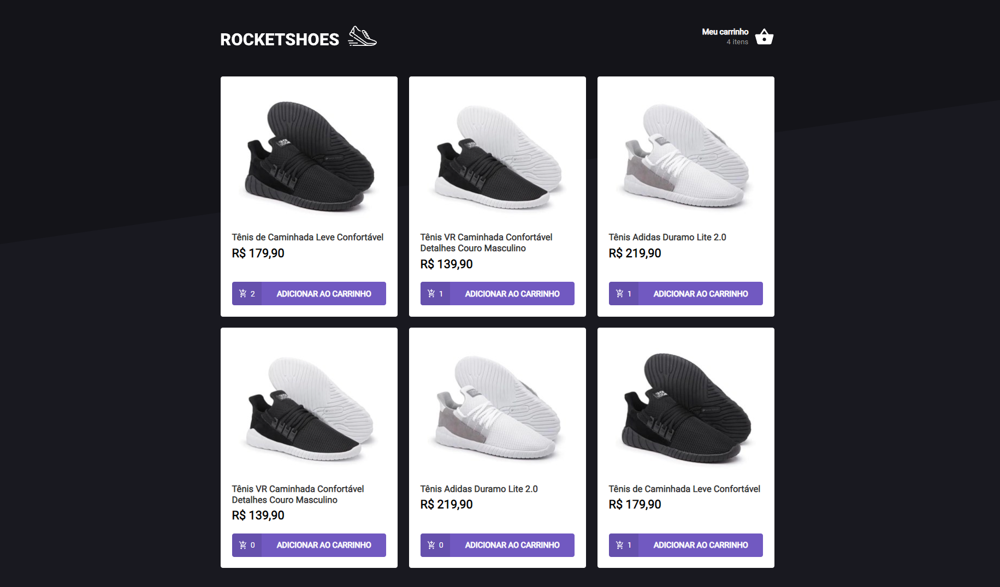

<h1 align="center">Rocketshoes</h1>
<h2 align="center">Rocketseat - Ignite - ReactJS</h2>

<h3 align="center">Chapter #2 - Challenge #1</h3>

  <a href="#-Project">Projeto</a>&nbsp;&nbsp;&nbsp;|&nbsp;&nbsp;&nbsp;
  <a href="#hammer_and_wrench-Features">Features</a>&nbsp;&nbsp;&nbsp;|&nbsp;&nbsp;&nbsp;
  <a href="#-Technologies">Tecnologias</a>&nbsp;&nbsp;&nbsp;|&nbsp;&nbsp;&nbsp;
  <a href="#-How-to-execute">Como usar</a>&nbsp;&nbsp;&nbsp;|&nbsp;&nbsp;&nbsp;
  <a href="#-Licence">Licença</a>

  

## 💻 Project

RocketShoes é uma aplicação web que gerencia compras vituais.  Este é o terceiro desafio de ReactJS do curso Ignite da [Rocketseat](https://rocketseat.com.br/).

## Features

- [x] Lista de produtos
- [x] Adicionar produtos no carrinho de compras
- [x] Alterar a quantidade de cada produto no carrinho

## ✨ Technologies

Este projeto foi desenvolvido com as tecnologias abaixo: 

- [React](https://reactjs.org)
- [TypeScript](https://www.typescriptlang.org)
- [Jest](https://jestjs.io)
- [Styled Components](https://styled-components.com)
- [JSON Server](https://github.com/typicode/json-server)
- [Axios](https://axios-http.com)
- [React-toastfy](https://fkhadra.github.io/react-toastify)
- [React Icons](https://react-icons.github.io/react-icons)
- [React Router](https://reactrouter.com)
- [Polished](https://polished.js.org)

## 🚀 Como Usar

- Clone o repositório
- Instale as dependências com `yarn`
- Execute o servidor com `yarn server`
- Execute a aplicação com `yarn start`
- Execute os testes com `yarn test`
- Acesse [`localhost:3000`](http://localhost:3000) no seu navegador

## 📄 Licence

Este projeto está sob a licença do MIT. Leia sobre a [LICENSE](./LICENSE) para mais detalhes.

---

Desenvolvido por Samael Melo e o time da Rocketseat 🚀🚀
